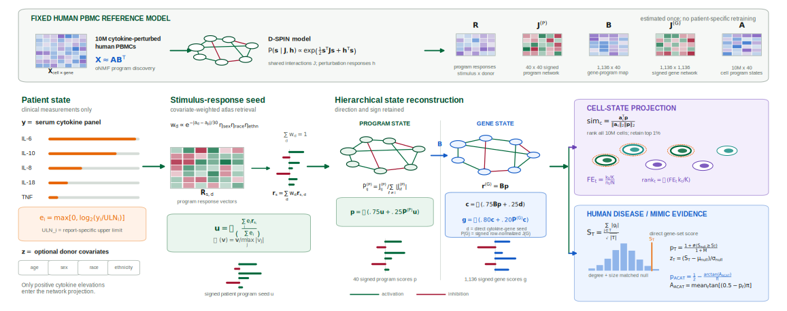

# CytoCarto

CytoCarto (Cytokine Cartography) projects a clinical cytokine panel into a fixed human PBMC D-SPIN reference atlas. It provides cytokine normalization, covariate-aware reference responses, signed program and gene-network projection, exact per-cell cell-type enrichment, human disease and mimic evidence retrieval, and human Perturb-Seqr mechanism evidence.

CytoCarto is an experimental research interpretation tool. It is not a validated diagnostic test and does not provide diagnostic probabilities.

## Access

The web application is available at [cytocarto.vercel.app](https://cytocarto.vercel.app).

## Repository contents

- `web/`: Next.js user interface.
- `web_api/`: FastAPI adapter around the unchanged interpreter.
- `scripts/cytokine_dspin_interpreter.py`: cytokine-to-program, gene, and cell-type projection workflow.
- `scripts/human_kg_disease.py`: human-only disease and mimic evidence layer.
- `scripts/public_evidence.py`: human Perturb-Seqr evidence retrieval and scoring.
- `config/cytokine_panels/`: clinical cytokine-panel aliases and reference defaults.
- `modal_backend.py`: optional Modal ASGI deployment wrapper.

The large D-SPIN reference atlas, per-cell program matrix, cell metadata, public-evidence caches, clinical input files, and generated patient reports are intentionally not included in this repository.

## Data and privacy

Raw pasted reports remain in the browser. The API receives normalized cytokine values and optional age, sex, race, and ethnicity. Do not submit names, medical-record numbers, dates of birth, or other direct identifiers.
